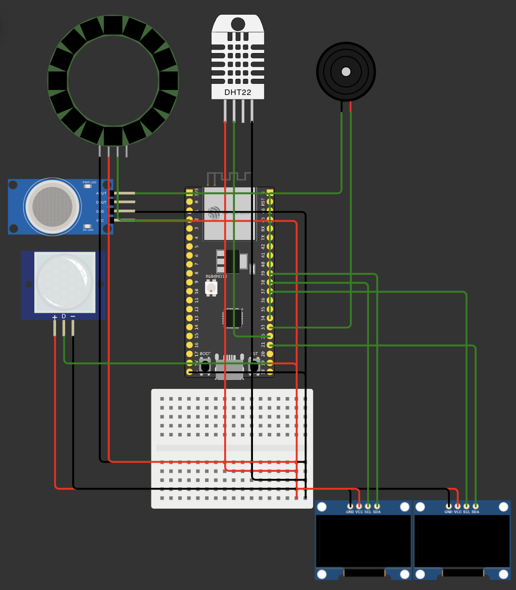
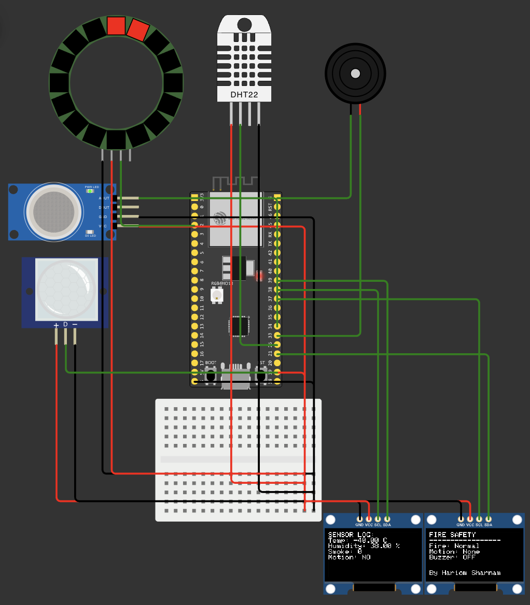
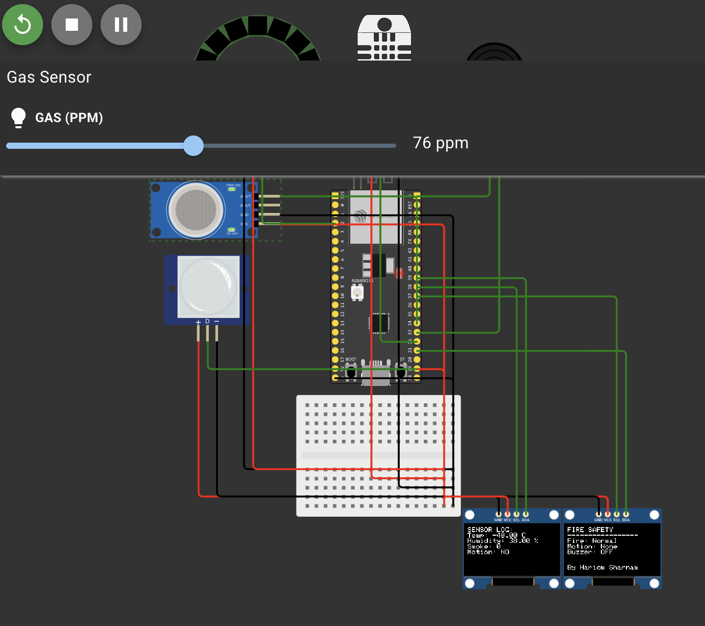
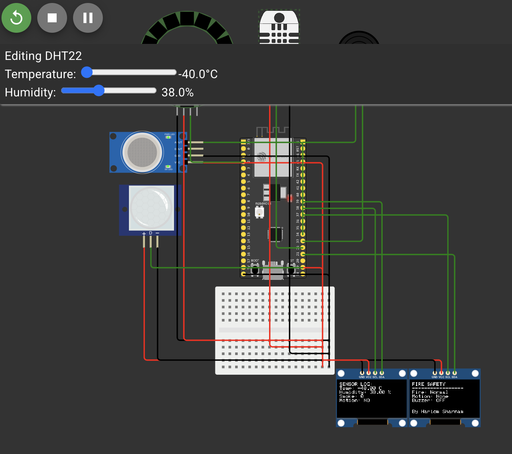
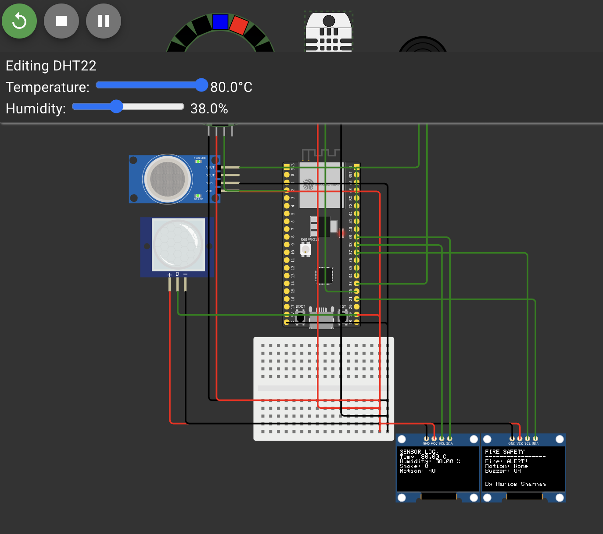
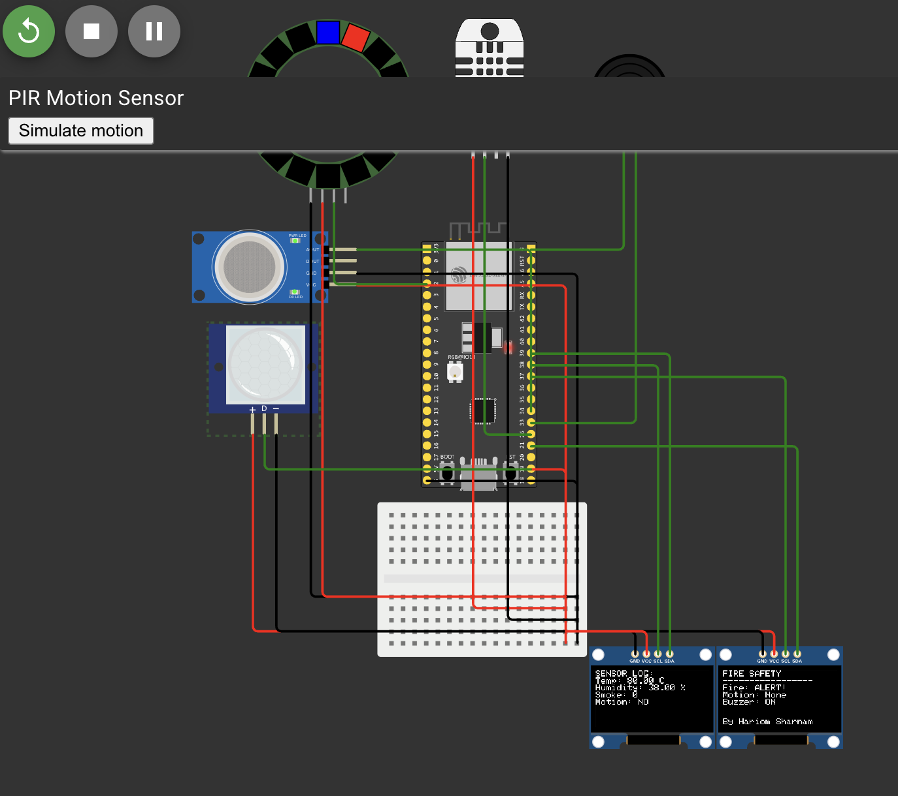

---

# FireSafety-IoT

**Project by Hariom Sharnam**

A **real-time Fire Safety System** using ESP32-S2, dual OLED displays, a NeoPixel ring, and multiple sensors. Designed for monitoring temperature, smoke, and motion for **home or workplace safety**, especially during high-risk situations like festivals or periods of high fire hazard.

This project demonstrates a **smart IoT system** capable of detecting fire early, providing instant alerts, and logging sensor data for analysis.

---

## Vision

Fire accidents are a significant hazard in households and workplaces. Traditional fire alarms often alert **too late**, only when smoke or fire has already spread.

This project is designed to:

* Detect **smoke, temperature spikes, and unusual motion** patterns in real-time.
* Provide **visual and audio alerts** that are immediate and intuitive.
* Maintain a **log of sensor readings** for monitoring trends and improving safety response.

The ultimate goal is to create a **proactive fire safety solution** that is easy to deploy, reliable, and informative.

---

## Project Functionality

The FireSafety-IoT system integrates multiple sensors and outputs to provide **comprehensive monitoring**:

### 1. Sensors

* **DHT22 (Temperature & Humidity Sensor)**

  * Continuously monitors ambient temperature and humidity.
  * Fires an alert if temperature exceeds the predefined threshold (`TEMP_FIRE`).

* **MQ-2 Gas/Smoke Sensor**

  * Detects smoke or gas in the environment.
  * Analog output on ESP32-S2 is 0–4095; alert is triggered if value exceeds `SMOKE_FIRE`.

* **PIR Motion Sensor**

  * Detects human presence.
  * Prevents false alarms by deactivating buzzer if motion is detected while fire is being handled.

### 2. Outputs

* **NeoPixel Ring**

  * Provides visual alert:

    * **Green:** Safe
    * **Orange → Red:** Fire detected
  * Full ring lights up, creating a clear visual signal.

* **Buzzer**

  * Produces audio alert only if fire is detected **without motion** nearby to reduce false alarms.

* **Dual OLED Displays**

  * **OLED1:** Shows fire alert status, motion detection, buzzer status, and project credit ("By Hariom Sharnam").
  * **OLED2:** Displays detailed **sensor logs**: temperature, humidity, smoke level, and motion.

### 3. Real-Time Monitoring

* Sensor readings are updated every **200ms**, providing fast and responsive monitoring.
* OLED updates are flicker-free to maintain readability.
* NeoPixel ring updates in real-time to reflect fire status.

---

## Hardware Overview

### ESP32-S2 Pin Connections

| Component         | ESP32-S2 Pin |
| ----------------- | ------------ |
| NeoPixel DIN      | 2            |
| PIR Motion Sensor | 19           |
| DHT22 Data        | 26           |
| Buzzer            | 33           |
| MQ-2 Analog       | 34           |
| OLED1 SDA         | 21           |
| OLED1 SCL         | 37           |
| OLED2 SDA         | 39           |
| OLED2 SCL         | 38           |

## Project Demo

The FireSafety-IoT system simulation, layout, and hardware setup are shown below:

**Simulation and Layout:**

  
*Figure 1: ESP32-S2 with sensors, NeoPixel ring, and dual OLED displays.*

  
*Figure 2: Breadboard layout showing sensor connections and wiring.*

  
*Figure 3: gas sensor.*

  
*Figure 4: OLED1 showing fire alert,editing dh22.*

  
*Figure 5: OLED2 showing real-time temperature, humidity, smoke, and motion readings.*

  
*Figure 6: PIR motion.*

**Power Requirements:**

* **5V rail:** Sensors & NeoPixel VCC
* **GND rail:** Common ground for all components

---

## Software / Libraries Required

* [Adafruit NeoPixel](https://github.com/adafruit/Adafruit_NeoPixel)
* [Adafruit SSD1306](https://github.com/adafruit/Adafruit_SSD1306)
* [DHT sensor library](https://github.com/adafruit/DHT-sensor-library)

**Development Environment:** Arduino IDE

---

## Sensor Thresholds

* `TEMP_FIRE` = 45°C → Temperature at which fire alert triggers
* `SMOKE_FIRE` = 300 (Analog read value) → Smoke threshold for alert
* PIR motion used to reduce false buzzer alarms

> These thresholds can be adjusted depending on the environment or sensitivity required.

---

## Operation Flow

1. **Sensor Reading**

   * DHT22 measures temperature & humidity
   * MQ-2 reads smoke levels
   * PIR detects motion

2. **Decision Logic**

   * Fire is considered **detected** if:

     * Temperature ≥ `TEMP_FIRE` OR
     * Smoke ≥ `SMOKE_FIRE`
   * Buzzer only sounds if fire is detected **and no motion** is present

3. **Display Updates**

   * **OLED1**: Shows fire status, motion, buzzer, and project credit
   * **OLED2**: Logs temperature, humidity, smoke, and motion readings

4. **NeoPixel Ring Updates**

   * **Fire Detected:** Full ring blinks from orange to red
   * **Safe:** Full ring solid green

---

## System Features

* Real-time monitoring with minimal delay
* Flicker-free dual OLED displays
* Full NeoPixel ring for immediate visual feedback
* Smart buzzer control to avoid false alarms
* Modular design; additional sensors can be added
* Configurable thresholds for smoke and temperature

---

## Installation & Usage

1. Install the required Arduino libraries via Arduino Library Manager.
2. Connect sensors, NeoPixel ring, and OLED displays to ESP32-S2 according to the hardware table.
3. Upload `FireSafetySystem.ino` to ESP32-S2.
4. Power the system.
5. Observe OLED displays for alerts and logs, and NeoPixel ring for visual fire indicators.

---

## Notes

* Ensure **NeoPixel ring is powered with 5V** and grounded correctly.
* Adjust `SMOKE_FIRE` threshold to suit your environment.
* Serial prints can be added for debugging sensor outputs.
* System designed to be **modular**, allowing easy integration of additional sensors or displays.

---

## Author

**Hariom Sharnam**
---
